# **Exercise 2A: Customizations at sender processing side**

The second exercise is focused on the business transaction activity: Purchase Order Response in where the SAP IDOC ORDRSP.ORDERS05 is the sender interchange payload. It involves determining the corresponding tax identifier from a lookup table in the form of a CSV file and writing it to the segment TAX with the qualifier 7 within the LIN segment group of the UN/EDIFACT ORDRSP outpout. This CSV file looks like following:

```csv
PARTN;IDTNR;Currency;TaxID|
0001000654;MZ-FG-S100;EUR;AAAA-01|
0001000654;MZ-FG-S200;EUR;BBBB-02|
0001000654;MZ-FG-S300;EUR;AAAA-01|
0001000654;MZ-FG-S400;EUR;BBBB-02|
0001000654;MZ-FG-S100;USD;CCCC-03|
0001000654;MZ-FG-S200;USD;CCCC-03|
0001000655;STC-23222;EUR;AAAA-01|
0001000655;TGB19424905;EUR;BBBB-02
```

In this case, the TaxId can only be determined using three input values (PARTN, IDTNR, Currency). If there is match of the 2 input values with the respective entries in the CSV file, a TaxID from the specific entry will be returned. The input of PARTN (partner number) is to be taken from the sold-to partner (E1EKA1[PARVW = AG]) in the sender IDOC message. The IDTNR originates from the respective line item, especially from the segment E1EDP19[QUALF = 002] "Material number used by vendor" within this line item (E1EDP01). The currency is a value that is maintained in the trading partner profile as a custom parameter, and it has to be handed over accordingly so that this can be used during the lookup in the mapping step. The expected output should be like in the following example in where you can see that each line item (LIN) has an additional TAX segment with the specific TaxID:

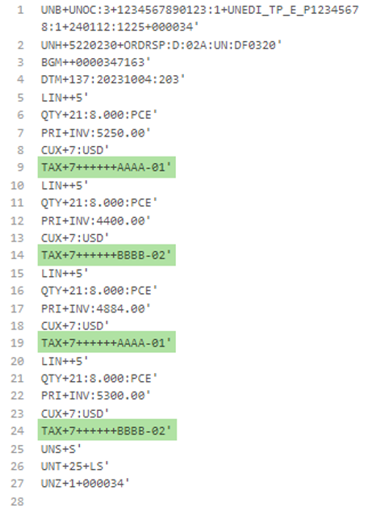

## **How does it work?**

The mentioned CSV file must exist in the data store: BTP4_CVM_Table, which emulates the external persistence. In a case of processing of the business transaction activity “Purchase Order Response”, the pre-processing step is calling the integration flow Pnnnnnnnn . Pre-Processing . OrderResponse - Outbound . SAP IDoc, which picks the appropriate entry from the data store and hands over as parameter to the next activity step, the mapping step. In order find the specific entry, a trading partner related an entry ID “Data_Store_Entry” must be maintained in the Trading Partner Profile(TPP) and referred in the corresponding Trading Partner Agreement(TPA). 

Pnnnnnnnn . Pre-Processing . OrderResponse - Outbound . SAP IDoc

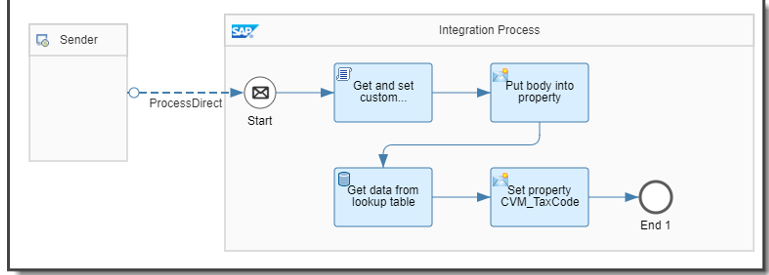

The mapping step gets the result of the BTP4_CVM_Table from pre-processing integration flow via the parameter “CVM_TaxCode” and the currency code via a further parameter Trading_Partner_Currency which is also maintained in the TPP and referred in the corresponding TPA.
Based on the mapped source elements:

+ Partner number from the sold-to partner (E1EKA1[PARVW = AG]/PARTN)
+ Material number used by vendor (E1EDP01/E1EDP19[QUALF = 002]/IDTNR)

And the Trading_Partner_Currency from the Trading Partner Profile, the following mapping functions returns the corresponding TaxID from the list CVM_TaxCode:

```xsl
<xsl:variable name="vPartnerID" select="$nodes_in/PARTN"/>
<xsl:variable name="vIdtNr" select="$nodes_in/IDTNR"/>
<xsl:variable name="vCurrency" select="$Trading_Partner_Currency"/>
<xsl:variable name="vLookupTable" select="tokenize($CVM_TaxCode, '\|')"/>
<xsl:value-of select="for $i in $vLookupTable return if(tokenize($i, ';')[1] = $vPartnerID and tokenize($i, ';')[2] = $vIdtNr and tokenize($i, ';')[3] = $vCurrency) then tokenize($i, ';')[4] else ()"/>
```

Especially the function for $i in $vLookupTable return if … loops across each entry, compares the three input values and returns the TaxID (fourth value) if there is a match.

## **Prerequisites**

1.	Exercise 1 is successfully fulfilled.
2.	Integration flow: Pnnnnnnnn . Pre-Processing . OrderResponse - Outbound . SAP IDoc is deployed
3.	Integration flow: P12345678 - Insert entry into lookup table BTP4_CVM_Table once so that you can find in the data store OpenSAP-BTP4_CVM_Table and entry with the ID: EDI_Pnnnnnnnn in where Pnnnnnnnn is your user id. See: Monitor -> Integrations and APIs  -> Data Stores  -> OpenSAP-BTP4_CVM_Table

## **Exercise Steps**

The following steps explain to you, how you can integrate integration flow that runs as custom pre-processing in front of the mapping step. It also explains how you can inject the results of the custom pre-processing into the mapping step itself.

1.	Go to your trading partner profile (TPP) such as P12345678 -> Parameters and enter the trading partner related parameters according to the following steps:
    1.	Click on “Create” button
    2.	Enter the Parameter Key: Trading_Partner_Currency, and
    3.	Enter the Value: EUR
    4.	Click on save button

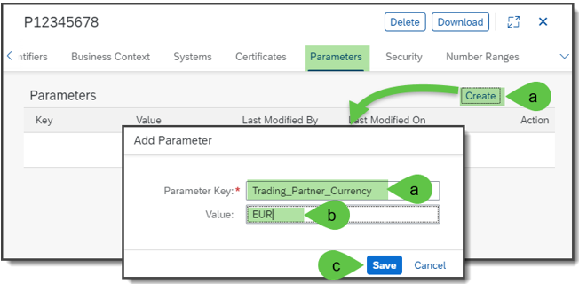

2.	Create a second custom parameter with the values:
    1.	Key: Data_Store_Entry
    2.	Value: EDI_Pnnnnnnn whereby Pnnnnnnnn is your user id.

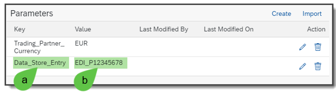

3.	Go to your trading partner agreement (Procure to Pay – Pnnnnnnnn). -> B2B Scenarios and open it in “Edit” mode. 
    1.	Open the “Activity Parameters”
    2.	Select Add Parameters -> Extend from TP -> Outbound

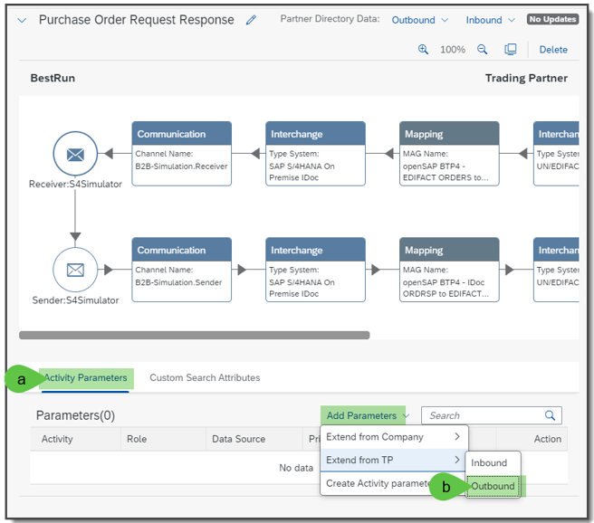

4.	In the window “Trading Partner Parameters”, select
    1.	Trading_Partner_Currency
    2.	Data_Store_Entry
    3.	Click on “Save” button

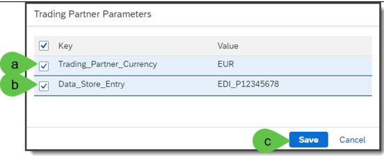

5.	You should see the two trading partner related custom parameters in the tab “Activity Parameters”.

   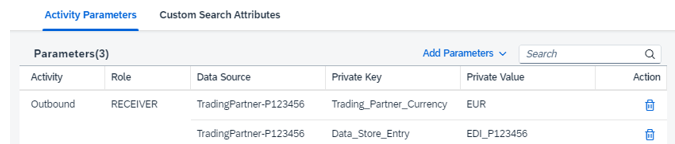

6.	The next step is to point in the sender interchange to prepared custom pre-processing flow which should be already available in your integration package: “openSAP-BTP4-Pnnnnnnn”. For getting this “pointing” address, 
    1.	Open the integration flow “Pnnnnnnnn . Pre-Processing . OrderResponse - Outbound . SAP IDoc” in your package
    2.	Do a double click on the “ProcessDirect” adapter
    3.	Go to tab “Connection” and copy the address “/TP_Pnnnnnnnn/tpm/pre-processing/orderResponse-outbound/sap_idoc” into the clipboard

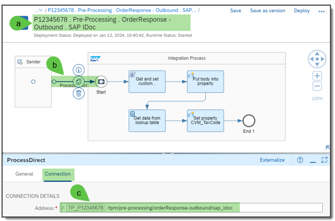

7.	Go back into the TPA “Procure to Pay – Pnnnnnnn” -> B2B Scenario
    1.	Select the sender interchange step at the purchase order responding activity
    2.	Enable the “Customized Pre-Processing” and
    3.	Insert the copied address “/TP_Pnnnnnnnn/tpm/pre-processing/orderResponse-outbound/sap_idoc” into the field of “Process Direct Address”.

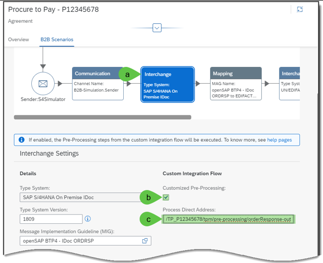

8.	To modify the mapping guideline so that this will do a correct tax output by using the result of this customized pre-processing you should do now the changes in this mapping guideline by
    1.	 Click on the business transaction activity step “Mapping”, and
    2.	Click on the version of the mapping guideline so that you will get to the Mapping Guideline itself.

**Remark: Take care that here you already work on your own Mapping Guideline which you created in [exercise 1](https://github.com/SAP-samples/integration-suite-b2b-exercises-basic/tree/main/exercises/Ex01)!**

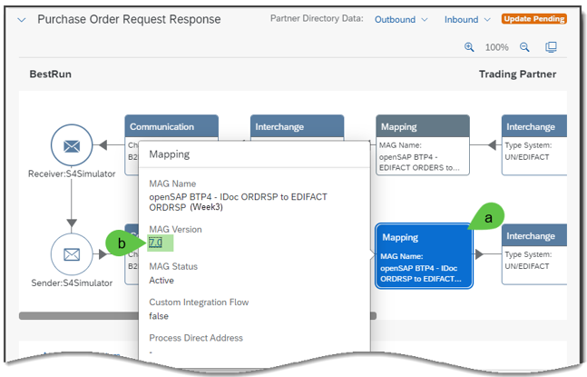

9.	But before you can do the changes in the mapping guideline, you should add the necessary segment group for the “Tax” into the target MIG that is based on the EDIFACT ORDRSP. For this purpose, you should
    1.	Enable the edit mode
    2.	Confirm the message for creating a new draft version in case you had an active status of the MAG
    3.	Click on the link of the target MIG above of the structure of the target MIG.

**Remark: Take care that here you already work on your own MIG which you created in [exercise 1](https://github.com/SAP-samples/integration-suite-b2b-exercises-basic/tree/main/exercises/Ex01)!** 

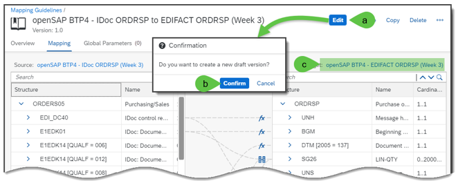

10.	Enable the edit mode of the MIG by:
    1.	Clicking on “Edit” button.
    2.	Confirm the message for creating a new draft version in case you had an active status of the MIG 

**Remark: Take that you work on your own MIG which you have created in the exercise in [exercise 1](https://github.com/SAP-samples/integration-suite-b2b-exercises-basic/tree/main/exercises/Ex01)!**

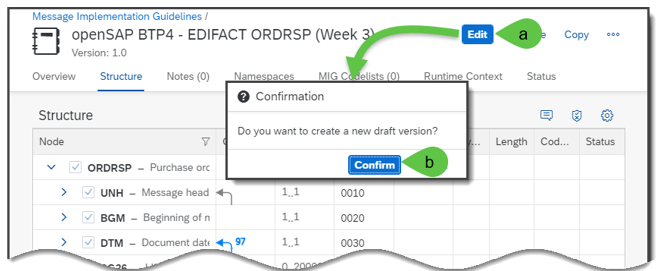

11.	If the opened target MIG is in “Edit” mode, insert the segment group 36 with the trigger segment “TAX” as you learned by the “Exercise 1”. In this trigger segment, you should just select the data elements: 
    + 5283 (Duty or fax or fee function)
    + 3446 (Party tax identifier)

This segment group should be qualified by the qualifier value “7” (Tax) from the data element 5283. Once you created the new qualified segment group, you should save the update MIG and may click on the button “Cancel” so this MIG is not locked.

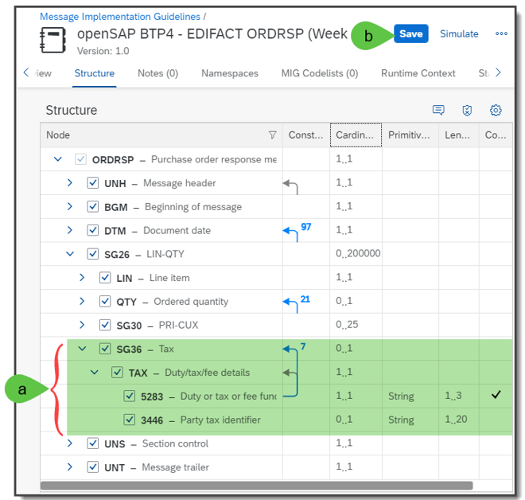

12.	Now you can update the MAG so that the tax information will be written into the EDIFACT target. The result of the tax will be provided by a camel exchange property. This can be obtained by a “Global Parameter” in the MAG. Therefore, go back into the MAG and
    1.	Click on tab “Global Parameters”
    2.	Create a new “Global Parameter” by clicking on button “Create”
    3.	In the window “Create New Global Parameter” insert in Parameter Name the name: “CVM_TaxCode”
    4.	And a short text in the field “Summary” such as: “Tax code list data store lookup table”
    5.	Click on “Create”.

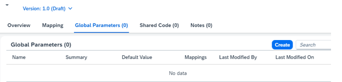

13.	Once you created this parameter, you should
    1.	See this new parameter in the list of “Global Parameters”
    2.	Add the second parameter “Trading_Partner_Currency” using the same procedure.
    3.	Click on “Create” button.
    4.	Save the MAG!

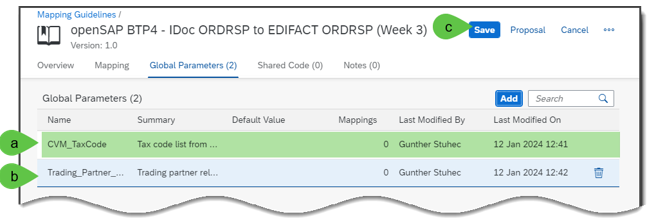

14.	Now you can extend the MAG with the new mapping element. For this purpose, you should refresh the MAG by using the F5 key so that you can see the extension made in the target MIG. Once the MAG is refreshed
    1.	Go to tab “Mapping”
    2.	In the source MIG, search for “PARVW = AG “ or scroll down to the node “E1EDKA1[PARVW = AG]” 
    3.	In the target MIG, search for the node 5283 or scroll down to the node 5283 under the Parent node SG36[5283 = 7], and 
    4.	If constant (#) is not available, set the constant by clicking on button “…”
    5.	Click on context menu item “Set Constant”
    6.	You should see the value “7”. If not enter it.
    7.	Click on “OK” button.
    8.	Create a mapping element from source node “PARTN” (Partner number) to target node “3446” (Party tax identifier).

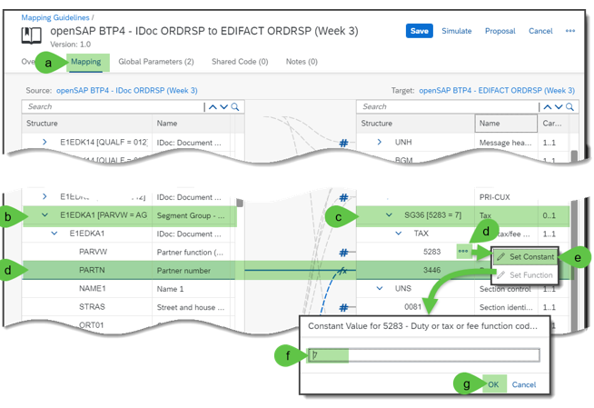

15.	Once you created this mapping element, you must insert a second source node and a function into this mapping element by
    1. 	In the source MIG, scroll down or search for “E1EDP19[QUALF = 002]
    2.	Create a mapping line from source leaf node IDTNR (IDOC material ID) to the target leaf node 3446 (Party tax identifier)
    3.	Insert the following function into XSLT code: 
      ```xsl
      <xsl:variable name="vPartnerID" select="$nodes_in/PARTN"/>
      <xsl:variable name="vIdtNr" select="$nodes_in/IDTNR"/>
      <xsl:variable name="vCurrency" select="$Trading_Partner_Currency"/>
      <xsl:variable name="vLookupTable" select="tokenize($CVM_TaxCode, '\|')"/>
      <xsl:value-of select="for $i in $vLookupTable return if(tokenize($i, ';')[1] = $vPartnerID and tokenize($i, ';')[2] = $vIdtNr and tokenize($i, ';')[3] = $vCurrency) then tokenize($i, ';')[4] else ()"/>
      ```
    4. Press the Validate Button to make sure the xslt is correct
    5.	Click on “Save” button.

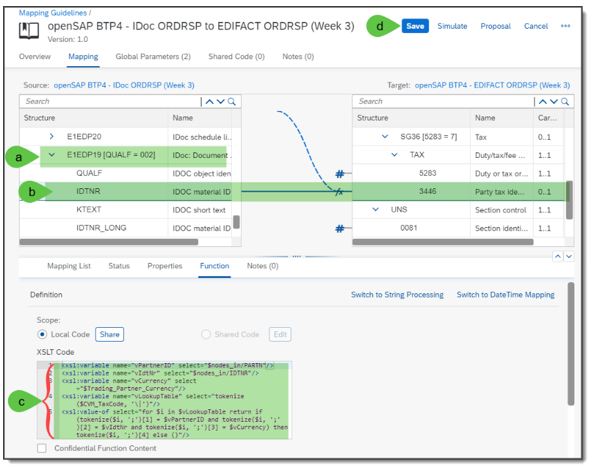

16.	Once you have made all the changes and in case you created a new version of your MAG, you must change the version in the Mapping step by updating to the latest version by the following steps, 
    1.	If the TPA is in “Edit” mode
    2.	Click on the mapping step at the “Purchase Order Response” activity
    3.	Click on button 
    4.	In the window “Select MAG” open the dropdown
    5.	Select the latest version.
    6.	Click on button “Choose.”

**Remark: The versions of the corresponding source and target MIGs will be updated, automatically.**

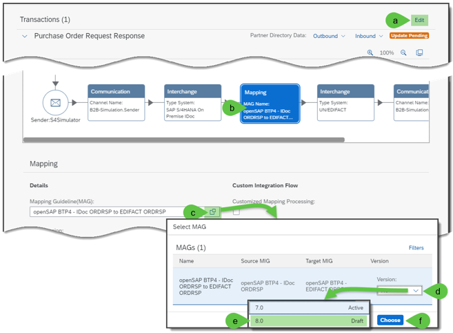

17.	If the MAG is now in the latest version, you can update the business transaction by going back to the TPA “Procure to Pay – Pnnnnnnn” and
    1.	Click on “Update” button, if this button is enabled.
    **Remark: If the “Update” button is not enabled, you can also do a deactivation or activation, or you can click on “Edit” and “Save” so that this “Update” button will get enabled.**
    2.	Select the business transaction “Purchase Order Request Response”, and
    3.	Click on “Update” button.

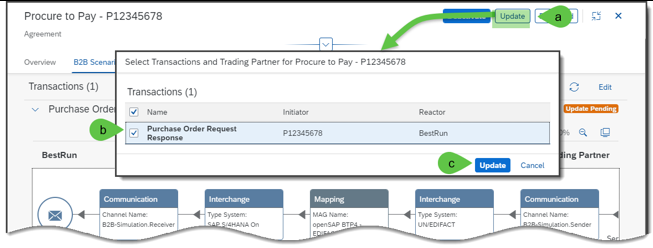

18.	Finally, you can simulate the changed business transaction by using B2B simulation via the API test tool. Hereby, you should send the corresponding SAP IDoc ORDRSP.ORDERS05 (purchase order response) by pressing the "Send" button

19.	In the response you’ll see the additional qualified TAX segment per line item in where you will also find the “Party tax identification” value which is coming from the provided lookup table.

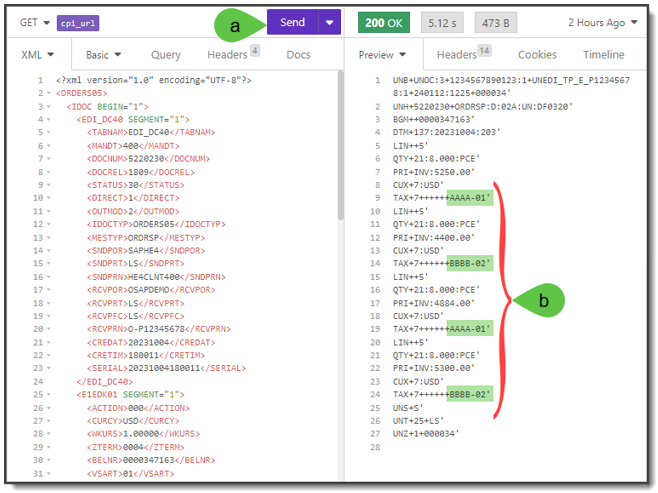

[Continue with Exercise 2B](../Exercise%202B/README.md)