# **Exercise 2D: Custom receiver communication channel**

In the fifth exercise, you will learn how to set-up other receiver communication protocols that are currently not supported by the TPM. In this case, you create and configure an SMTP (eMail) receiver communication using a custom receiver communication integration flow, which will be configured in the Trading Partner Profile and enabled in the Trading Partner Agreement.

## **Prerequisites**

1.	Exercise 1 must be successfully fulfilled.
2.	Integration flow: Pnnnnnnn . Post-Processing . OrderResponse - Outbound. UN-EDIFACT is deployed

## **Configuration Steps and Test**

The following steps explain, how you can set up a custom communication channel at the receiver side. In this case, it covers a receiver communication based on the currently non supported communication protocol: SMTP (eMail).


1.	First of all, you need now the ProcessDirect address of the already created communication integration flow “Pnnnnnnnn - Step 3b - eMail.Receiver”
    1.	Do a double click on the adapter line “ProcessDirect” so that you can see the details of the “ProcessDirect”.
    2.	Take in tab “Connection” the address: /TP_Pnnnnnnnn/ tpm/email/receiver and copy into a notepad (Please consider Pnnnnnnn should be your user id)

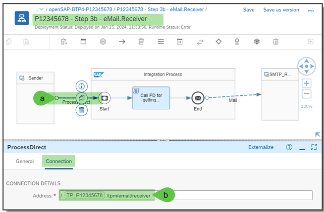

2.	Now take the necessary variables from the e-mail communication which you must add in the TPA configuration.
    1.	Therefore, do a double click on the communication adapter “Mail” 
    2.	Open the tab “Processing”, and copy the following variables into the notepad
    3.	```Mail_Receiver_To```
    4.	```Mail_Receiver_Message_Subject```

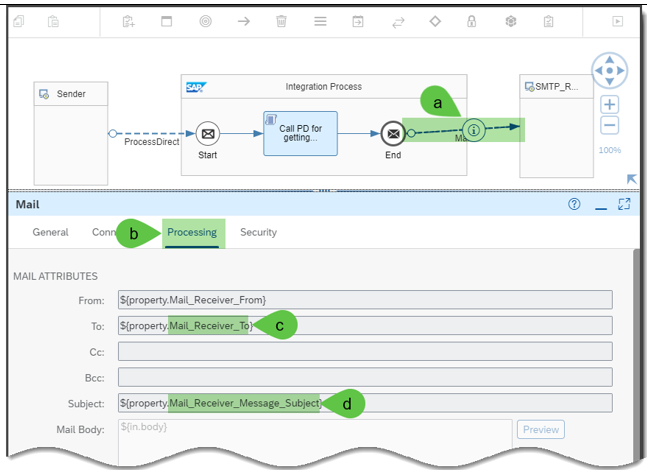

3.	First of all, add the ```Mail_Receiver_To``` into the trading partner profile of your trading partner “Pnnnnnnnn”. For this purpose,
    1.	Go to your trading partner profile “Pnnnnnnn”
    2.	Open the tab “Systems”.
    3.	Go to tab “Communication”.
    4.	And click on “Create” button.

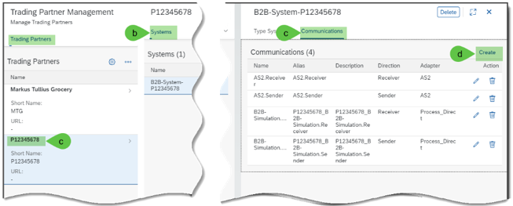

4. 	In the new window “Add Communication” add and select the following values:
    1.	Name such as: EMail.Receiver
    2.	An alias name such as Pnnnnnnnn_EMail.Receiver
    3.	A description such as Pnnnnnnnn_EMail.Receiver
    4.	The Direction: Receiver
    5.	The Adapter: Process_Direct
    6.	The address in the connection details, which you copied into your notepad such as: ```/TP_Pnnnnnnnn/tpm/email/receiver```
    7.	Click on “Save” button.

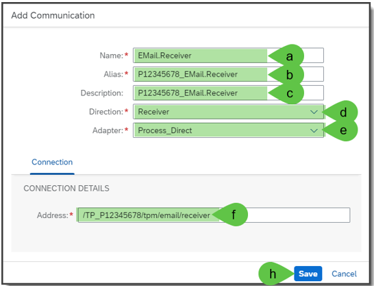

5.	Once you saved this new communication channel
    1.	You should now see a new entry in the list of “Communications”.
    2.	And you should change to “Parameters”.

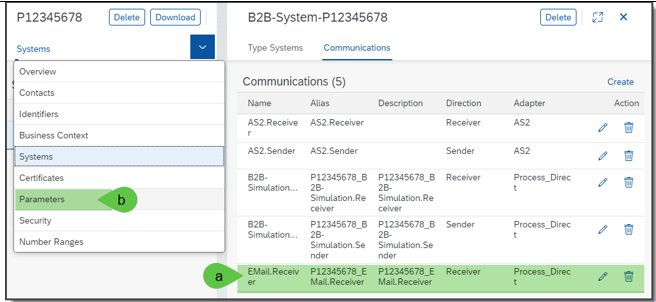

6.	In “Parameter” you 
    1. 	Should create a new custom parameter by clicking the “Create” button, and
    2.	Adding the parameter with the Key: ```Mail_Receiver_To``` Value: Email address of your choice

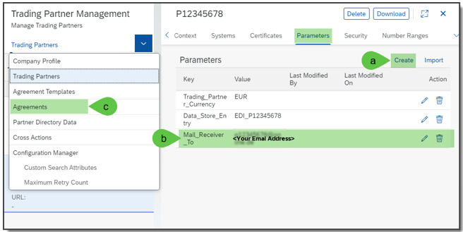

7.	Now you can go to your TPA “Procure to Pay – Pnnnnnnn”. This should be in edit mode. 
    1.	Select the receiver communication channel in business transaction activity “Purchase Order Response”
    2.	And select the newly added communication channel “EMail.Receiver”
    3.	Click on a place outside of the activity steps so that you can see the overall panel with “Activity Parameters” and “Custom Search Attributes”

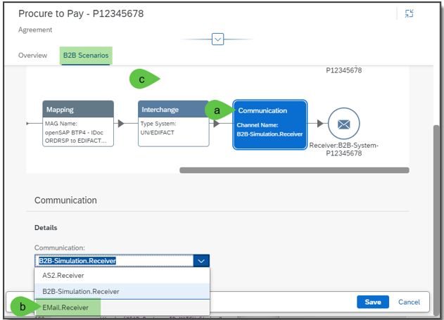

8.	Once you can see the overall panel
    1.	Select the tab “Activity Parameters”
    2.	Select Add Parameters -> Extend from Company -> Outbound
    3.	In the opened window select the custom parameter ```Mail_Receiver_From``` which is from the company profile “BestRun”.
    4.	Click on “Save” button.

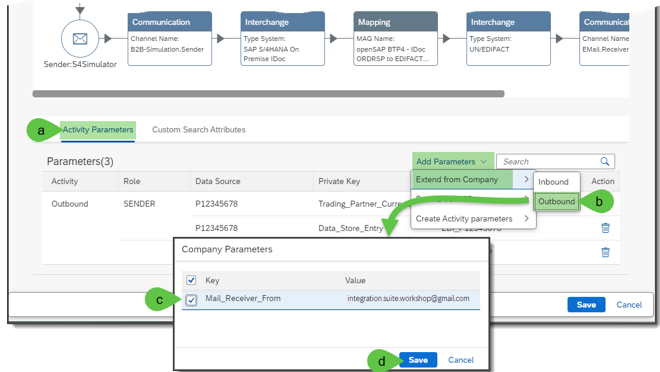

9.**Just if customer parameter is missing** If you don’t find the specific company parameter, you should add it in the “Company Profile” by the following steps:
    1.	Go Company Profile and select "BestRun"
    2.	Click on tab "Parameters"
    3.	Click on "Create" button
    4.	In the opened window “Add Parameter”, enter parameter key: ```Mail_Receiver_From```, and
    5.	Enter parameter value: ```integration.suite.workshop@gmail.com```
    6.	Click on "Save" button.
    7.	Now you should see a new entry in the list of “Company Parameters”. You can now go ahead with the company parameter selection as described in step 8.

**Remark**: This activity should be just done once per tenant.

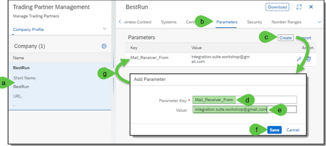

10.	You should select the trading partner related custom parameter with the email address from the trading partner profile by
    1.	Select Add Parameters -> Extend from TP -> Outbound
    2.	In the opened window select the custom parameter ```Mail_Receiver_To``` which is from the trading partner profile “Pnnnnnnn”.
    3.	Click on “Save” button.

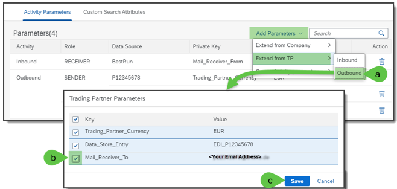

11.	Finally, you should create a activity related custom parameter with the subject
    1.	Select Add Parameters -> Create Activity parameters -> Outbound
    2.	In the opened window “Add Parameter” enter the custom parameter ```Mail_Receiver_Message_Subject```
    3.	With the value “EDIFACT ORDRSP (Order Response)”

12.	Click on “Save” button for this custom parameter.
    
13.	Click on “Save” button for saving the whole TPA.

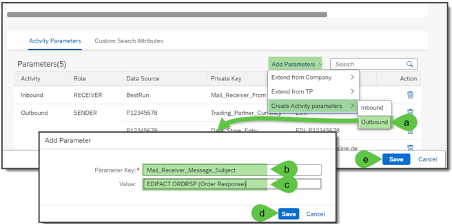

14.	Once you successfully saved the TPA with the updates click on “Update” button for getting these extensions into the Partner Directory

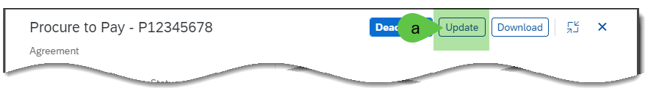

15.	Once the updates are successfully written into the Partner Directory, go to your API test tool and 
    1.	Send the message IDOC ORDRSP.ORDERS05 (Order Response)
    2.	You’ll see an error, because you are using a different receiver communication channel for sending the messages via email to an receiver and not this one, which returns the message back for showing it a s response in the HTTP request of your API testing tool.

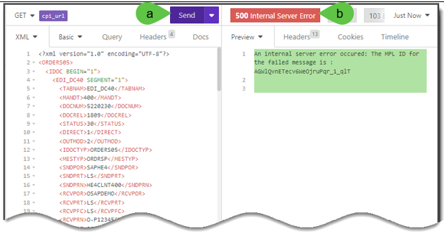

16.	Finally, you should see in the email account of your choice the received message with the UN/EDIFACT interchange payload having an ORDRSP message.

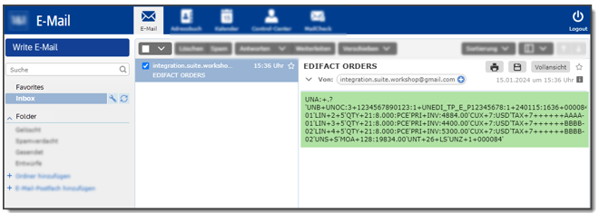