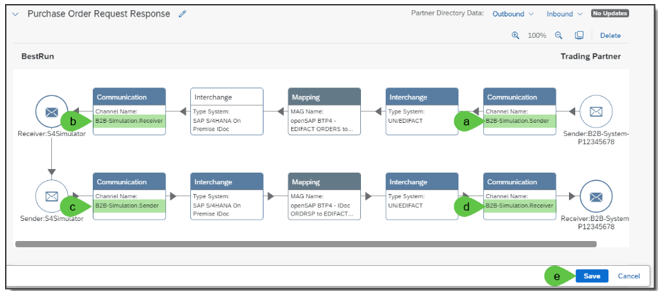

# **Exercise 2: set up B2B Simulation**

In the this exercise, we set up a B2B simulation so that you can use an API test tool to send the interchange payloads to the Integration Suite - B2B system via an HTTP request. The received result via the synchronous HTTP response will be displayed in the same session of the API test tool like shown in the following figure.
To make all entities unique we recommend adding your user id like TradingPartner-P123456 (if your userid is P123456). If your user is like UserXX so, please create then entities like TradingPartner-UserXX. In other words: please replace the “P” with “User” and the “123456” with your number. As all identifiers are compared as strings be very precise (especially with upper and lower case) there otherwise you will run into error messages.

## **How does it work?**

This B2B simulation is based on 2 integration flows which are connected to the B2B generic flows via ProcessDirect. 

These are:
+	Pnnnnnnnn - Step 1a - B2B Simulation.Sender – This integration flow is responsible for passing the received interchange payload from the API test tool to the step 1b flow for further extraction and processing. Furthermore, this integration flow waits for a few seconds and then obtains the result from the data store, which was stored in here by the Pnnnnnnnn - Step 3b - B2B Simulation.Receiver flow. It returns this resulting interchange payload back to the API test tool using the synchronous HTTP response. The correlation between the sender and receiver interchange payload takes place by using the unique message identification or interchange control number, which is returned via the ProcessDirect call to step 1b flow.

+	Pnnnnnnnn - Step 3b - B2B Simulation.Receiver - This flow is responsible for passing the final assembled and converted interchange payload to the sender integration flow “Pnnnnnnnn - Step 1a - B2B Simulation.Sender”.  To do this, it stores the resulting interchange payload into the data store together with interchange control number or the message id of the sender interchange payload that is used as correlation identification. This integration flow will be called by Step 3 flow. If the interchange payloads are EDIFACT or ASC X12 interchanges and based on this syntax, line feeds are inserted at the end of each segment if this is desired. 
 

Pnnnnnnnn - Step 1a - B2B Simulation.Sender

Pnnnnnnnn - Step 3b - B2B Simulation.Receiver

## **Prerequisites**

1.	The exercise 1 must be successfully fulfilled.
2.	Pnnnnnnnn - Step 1a - B2B Simulation.Sender must be deployed.
3.	Pnnnnnnnn - Step 3b - B2B Simulation.Receiver must be deployed.
4.	An API test tool such as Insomnia is successfully installed on your computer.

## **Exercise Steps**

The following steps explain to you how you can set up and test the API testing tool based B2B simulation using the 2 already prepared custom communication integration flows:
+ Pnnnnnnnn - Step 1a - B2B Simulation.Sender
+ Pnnnnnnnn - Step 3b - B2B Simulation.Receiver

1. Create the B2B receiver simulation communication channel by the following steps:

    1.	Go to B2B Scenarios -> Your Trading Partner (P12345678)  -> Systems  -> Communications
    2.	Click on “Create” button
    3.	Enter the Name: “B2B-Simulation.Receiver”
    4.	Enter the Alias: “P12345678_B2B-Simulation.Receiver” whereby P12345678 is your user id
    5.	Enter the same value as Description
    6.	Select the Direction: Receiver
    7.	Select the Adapter “Process_Direct”
    8.	Enter the Address: /TP_P12345678/tpm/b2b-simulation/receiver whereby P12345678 is your user id address
    9.	Click on “Save” button

2.	Stay in the in the “Communication Channel” and create the B2B sender simulation communication channel by the following steps:
    1.	Click on “Create” button
    2.	Enter the Name: “B2B-Simulation.Sender”
    3.	Enter the Alias: “P12345678_B2B-Simulation.Sender” whereby P12345678 is your user id
    4.	Enter the same value as Description
    5.	Select the Direction: Sender
    6.	Select the Adapter “Process_Direct”
    7.	Click on “Save” button

3.	Open your trading partner agreement “Procure to Pay - P12345678” that you created in exercise 1, and
    1.	Deactivate it, and
    2.	Click on “Edit” button

4.	Change the communication channels accordingly:
    1.	Purchase Order Request – Sender Communication: B2B-Simulation.Sender
    2.	Purchase Order Request – Receiver Communication: B2B-Simulation.Receiver
    3.	Purchase Order Response – Sender Communication: B2B-Simulation.Sender
    4.	Purchase Order Response – Receiver Communication: B2B-Simulation.Receiver
    5.	Click on “Save” button

5. Write the changed configuration into the Partner Directory by clicking on the “Activate” button

6.	Take your API test tool of your choice. We prepared the content for Insomnia. If you don’t have installed an API test tool, download and install it for one of the following download sites:
Insomnia: https://insomnia.rest/download

7.	Your Tenant is opensapeu01
8.	If you go for Insomnia
    1.	Click on “Import” and
    2.	Import the provided collection “OpenSAP BTP4 - B2B Simulation - Insomnia Collection” from the discovery page

9.	Once you successfully imported the collection
    1.	You should see the collection of the prepared HTTP Get Requests
    2.	Click on button ( ) for managing environments
    3.	In the window “Management Environments” select your tenant (openSAPEU01)
    4.	Subsitute the user id Pnnnnnnnnn with your user id such as P12345678 (or e.g. User13) and click on close button.

10.	Back in the main view select the environment of your tenant name that you identified in step 7

11.	If you are now in the Insomnia “Collection” view:
    1.	Go to the Purchase Order Request -° UN/EDIFACT ORDERS entry.
    2.	Click on “Headers” tab for checking the header attributes.

12.	In the “Header” attributes view you should see:
    1.	communication_protocol: Process_Direct
    Which is in this case the sender communication channel type
    2.	message_content_type: application/EDIFACT
    Which is the sending MIME Type content type.
    3.	type_system: UN-EDIFACT
    Which is the sending type system
    4.	insert_carriage_return: true 

true means, that a carriage return will be inserted after each segment.
If you set “false”, you’ll get the receiver UN/EDIFACT interchange payload without carriage return after each segment.

12.	Now you can simulate the end-to-end flow
    1.	Click on “Send” button, and
    2.	You’ll see the result in the HTTP response part after view seconds, if everything was processed sufficiently.

[Continue with Exercise 2A](Exercise/Ex1/EXERCISE%201A%3A%20CUSTOMIZATIONS%20AT%20SENDER%20PROCESSING%20SIDE/README.md)
