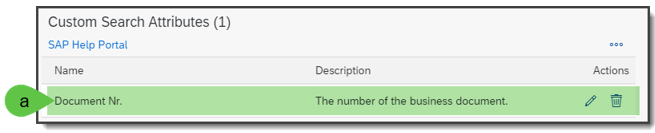
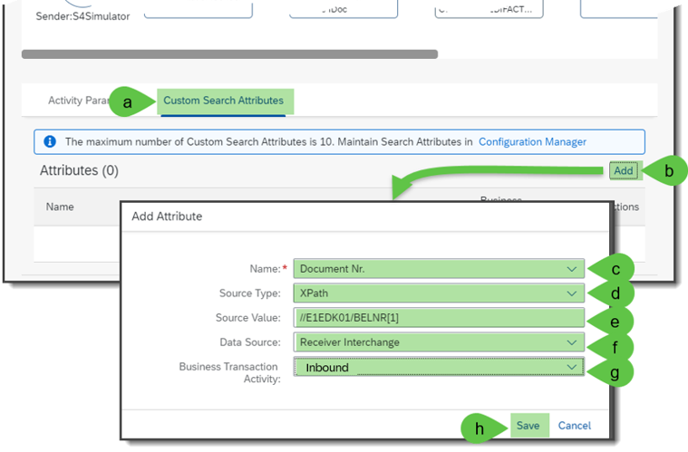
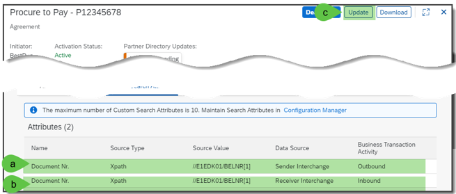
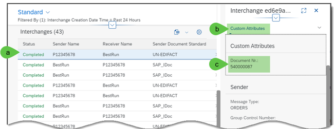
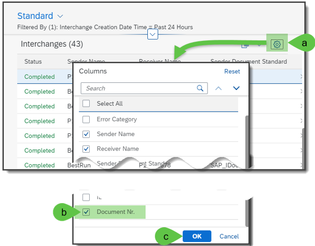
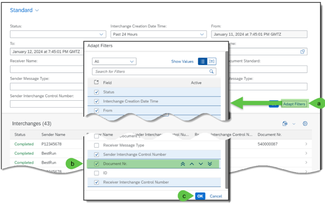
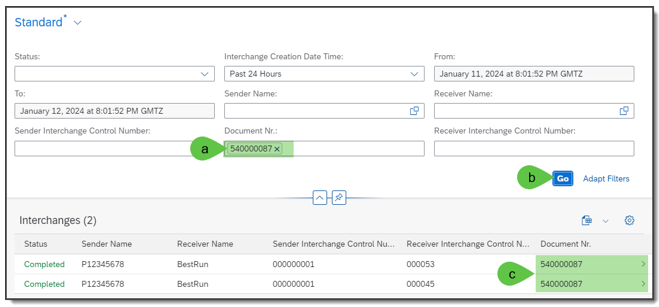

# **Exercise 2B: search attributes**

In the third exercise, you will learn how to configure the B2B monitoring specific search attributes and how to display and use them in B2B monitoring. Search attributes help you to show further values in B2B monitoring which will not provide by the TPM standard parameters. For example, you can than obtain for example business document or purchase order numbers per sender or receiver interchange payload and display them in the B2B monitoring. Furthermore, you can search for B2B interchange entries via these attributes such as business document or purchase order number.

## **Prerequisites**

1.	Exercise 1 must be successfully fulfilled.
2.	Integration flow: Pnnnnnnn . Post-Processing . OrderResponse - Outbound. UN-EDIFACT is deployed.

## **Configuration Steps and Test**

The following steps explain how you can set up search attributes and use these in the B2B Monitoring.

1.	This step is already done by us but check it before!
2.	In the “Trading Partner Management”
    1.	Open the tab “Configuration Manager”
    2.	In the section “Custom Search Attributes”, click on the menu button with the three points, if “Create” is not visible.
    3.	Click on the “Create” button.
    4.	In the opened window “Create Attribute” enter in the field of “Name”: Document Nr.
    5.	And in the field of “Description”: The number of the business document
    6.	Click on “Save” button.

3.	In the list of “Custom Search Attributes”
    1.	Now you should see one entry with the name “Document Nr.”.

**Remark**: Please consider, currently it is possible to create up to ten different search attributes for the overall tenant. If another user already created a search attribute with the name “Document Nr.”, you could define a new search attribute with another name. You can create search attributes as long as 10 search attributes are not created at your tenant. You can also use one of already existing search attributes for the next steps.

1. Go into your TPA: “Procure to Pay – Pnnnnnnnn” and
    1.	Open the tab “Custom Search Attributes.”
    2.	Click on “Add” button for the insertion of a search attribute.
    3.	In the opened window “Add Attribute” select in “Name” the value: “Document Nr.”
    4.	Select the “Source Type”: XPath
    5.	Enter the XPath expression: `//E1EDK01/BELNR[1]`
    6.	Select the Data Source: Receiver Interchange
    7.	Select the Business Transaction Activity: Inbound
    8.	Click on “Save” button.

5.	After creating this search attribute, you
    1.	Should see this search attribute in the list of “Attributes”.
    2.	Add another search attribute with the parameters:
        1. “Name”: “Document Nr.”
        2. “Source Type”: XPath
        3.	XPath expression: `//E1EDK01/BELNR[1]`
        4.	Data Source: Sender Interchange
        5.	Business Transaction Activity: Outbound
    3.	 Save and Click on “Update” button.

6.	Now, you can go to your API testing tool and send for e.g., the IDOC ORDRSP.ORDERS05 - Purchase Order Response message.

7.	Go to the B2B Monitoring as described in the exercise 1. If you do an update
    1.	You might see a new entry in where you should open the details.
    2.	In the detail panel, click on the tab “Custom Attributes”. 
    3.	You will see the tag “Document Nr.” with the value from the element `/ORDERS05/E1EDK01/BELNR[1]`.

8.	You can also add these search attributes in the B2B Monitoring overview list by
    1.	Clicking on the “Customization” button in the overview list “Interchanges”.
    2.	You see a window “Columns” in where you can select and deselect the visibility of the columns. Select in here the search attribute “Document Nr.”
    3.	Click on “OK” button.

9.	For searching, you must add the search attributes into the search mask by
    1.	Clicking on “Go” button.
    2.	Select the search attribute “Document Nr.” in the opened window “Adapt Filters”, and
    3.	Click on “OK” button.

10.	You will find now the B2B Monitoring list for the search attributes the search field and column “Document Nr.”
    1.	You can now enter the value of the BELNR into the search field “Document Nr.”
    2.	Click on “Go” button.
    3.	And you’ll see just the filtered list of interchanges with the same value in field “Document Nr.”.

[Continue with Exercise 2C](Exercise/Ex1/EXERCISE%201C%3A%20CUSTOMIZATIONS%20AT%20RECEIVER%20PROCESSING%20SIDE/README.md)
