# **Exercise 2C: Customizations at receiver processing side**

In the this exercise, you will learn how to do a further sorting of the mapping output through an integration flow “Pnnnnnnn . Post-Processing . OrderResponse - Outbound. UN-EDIFACT” that is called by custom post-processing.  In this case, the line items should be sorted according to the Tax Identifiers from Exercise 3. It means the line items with the same Tax Identifiers should be grouped together. 

You will also learn, how you can calculate a summary of line items. This should be provided via an additional MOA (Monetary Amount) segment in the trailer part of the message. 

You will also learn, how you can set of ordinal numbers per line item in the data element 1082 (Line item identifier) of the LIN segment. Like in the following example shown, a further part of this exercise is the insertion of further values that are not supported by the standard TPA configuration such as the value EDI_ORDRPS in the data element 0032 – Communications agreement into the UNB interchange envelope segment and the insertion the UNA (Service String Advice) segment.
The expected output should be:

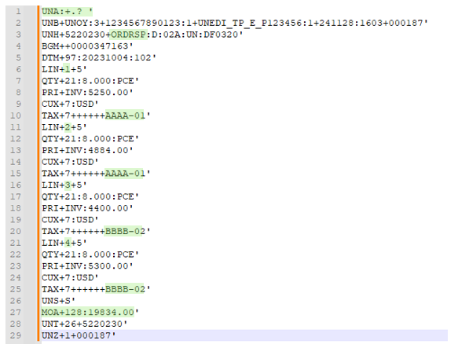

## **How does it works**

The integration flow of the custom post-processing “Pnnnnnnn . Post-Processing . OrderResponse - Outbound. UN-EDIFACT” is very simple. It just calls a XSLT script, which is responsible for:

1. Sorting of line items – This is realized by the XSLT function “for-each-group” in where each tax identifier (./G_SG36[1]/S_TAX[1]/D_3446[1]) will be the group criteria for the grouping. This group criteria is provided by the attribute “group-by”.
2. Summary in MOA segment – This function needs an already generated data element D_5004 (Monetary amount) in the generated MOA summary segment. If there is a match to this data element (xsl:template match="D_5004[../D_5025 = '128']"), the XSLT calculates the sum and returns this sum in specific output format by the function format-number(sum(preceding::D_5118), '#.00')
3. Set ordinal number in LIN segment – This function also needs an already generated data element D_1082. If there is a match to this data element (xsl:template match="D_1082"), the XSLT calculates for this data element the ordinal number by the function count(preceding::G_SG26) + 1 and inserts to it.

XSLT Script:

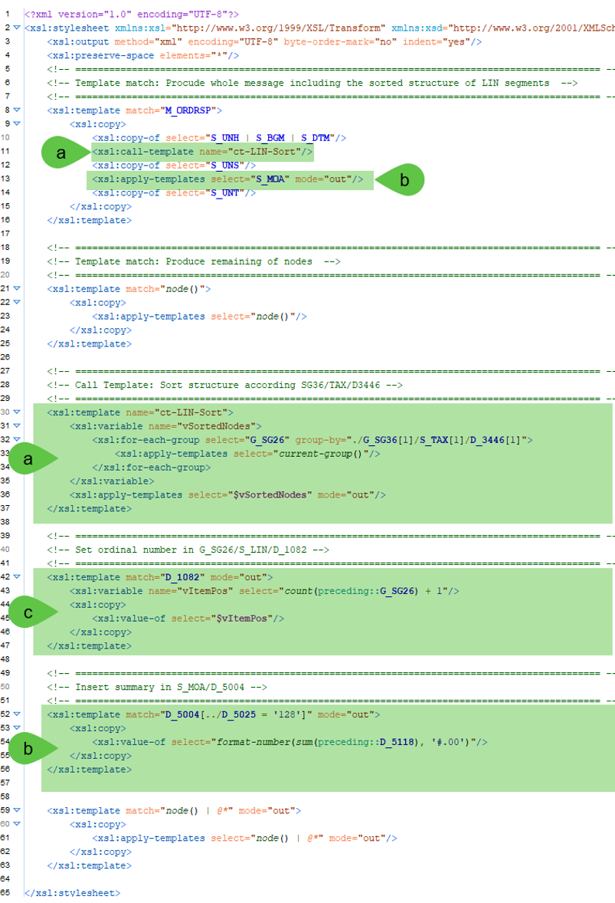

## **Prerequisites**

1.	[Exercise 1](https://github.com/SAP-samples/integration-suite-b2b-exercises-basic/tree/main/exercises/Ex01) must be successfully fulfilled.
2.	Integration flow: Pnnnnnnn . Post-Processing . OrderResponse - Outbound. UN-EDIFACT must be deployed.

## **Configuration Steps and Test**

The following steps explain how you can set up a custom post-processing, which will manipulate the target payload after the mapping step.

1.	You need now further extensions in the target MIG and MAG. Therefore, open your TPA “Procure to Pay – Pnnnnnnn”.
    1.	Select the business transaction activity “Purcchase Order Response” the step “Mapping”, and
    2.	Open the MAG by clicking on the version in the opened callout.

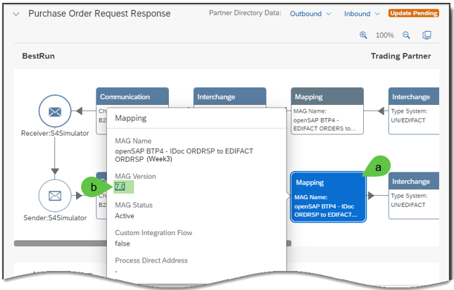

2.	Once the MAG is opened
    1.	Enable the MAG in edit mode by clicking on “Edit” button, and
    2.	Open the target MIG by clicking on the link on top of the target structure.

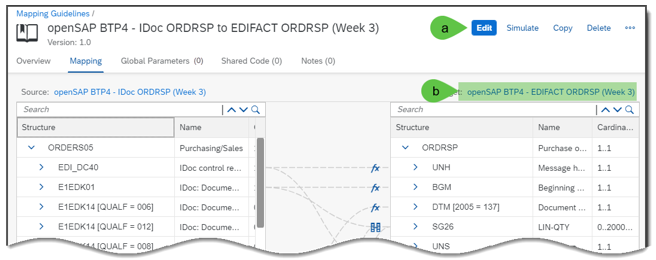

3.	Switch to the edit mode. Once you did it, add following group and leaf nodes according to the instructions of creating a MIG (Chapter 2) from [Exercise 1](https://github.com/SAP-samples/integration-suite-b2b-exercises-basic/tree/main/exercises/Ex01).

    1.	Data element 1082 (Line item identifier) in SG26  LIN
    2.	Segment group “MOA” (Monetary Amount) underneath the segment UNS. This MOA segment should be qualified with the qualifier value “128” (Total amount) and the following child nodes should be selected:
        1.	C516 – Monetary Amount
        2.	5025 – Monetary amount type code qualifier
        3.	5004 – Monetary amount
    3.	Click on “Save” button and may “Cancel” button for unlocking the MIG.

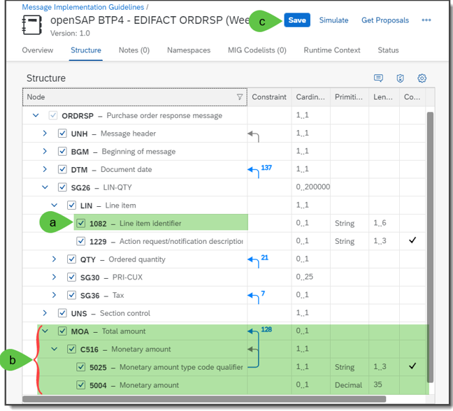

4.	Now you can add the additional mapping elements into the MAG. Therefore, go back into the opened “MAG” and click on refresh button (F5) so that you can see the extensions made in the target MIG. Once the MAG in the edit mode, you should do following steps:
    1.	If there is a mapping to the node 1082 delete this (right click on the line and press delete)
    2.	Add in the leaf node (data element) 1082 - Line item identifier underneath SG26  LIN a constant by clicking on action button, and
    3.	Add the constant value “###” into it so that this leaf node will be created in target payload.
    4.	Click on “OK” button.
    5.	Crate a mapping element from source group node “E1EDS01” to the target group node “MOA[5025 = 128] so that this group node will be created in the target payload.
    (**Remark**: This group node will be otherwise not created, because it is optional)
    6.	Go to the leaf node (data element) 5004 – Monetary among and click on action button.
    7.	So that you can enter the constant “1” (it must be an integer).
    8.	Click on button “OK”.
    9.	Click on “Save” button and may “Cancel” button for unlocking the MAG.

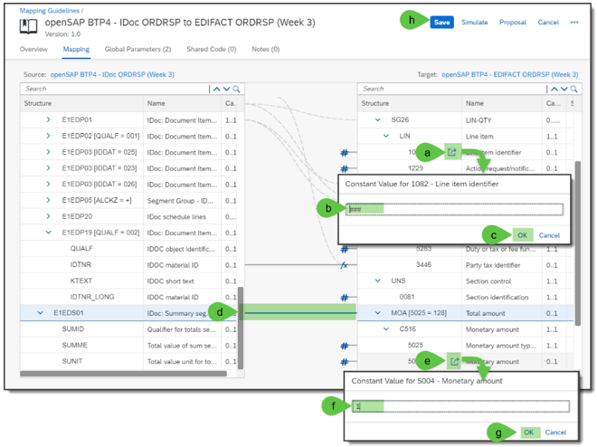

1. Once you added the extensions into the MAG, go back into your TPA “Procure to Pay - P12345678” and add further activity parameters which inserts additional values into the envelope header (UNB segment) by 
    1.	Open the tab “Activity Parameters”
    2.	Click on Add Parameters -> Create activity parameters  -> Outbound
    3.	Add the parameter key “SAP_EDI_REC_Interchange _Agreement_ID” which refers to the data element 0032 – Communications agreement ID in the UNB segment
    4.	Enter the value “EDI_ORDRSP”.
    5.	Click on “Save” button.

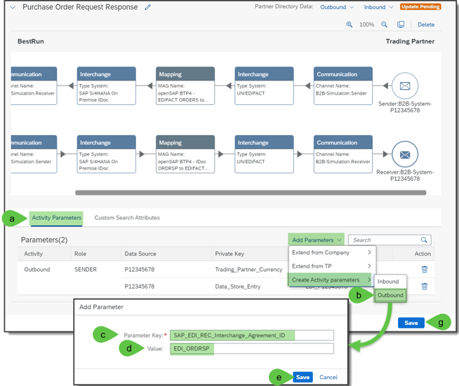

6.	Once the new activity parameter is saved, you 
    1.	Should see the new entry in the list of “Activity parameters”. 
    2.	Should than go to the receiver activity step “Interchange”. In here you should enter the address for pointing to the custom post-processing.

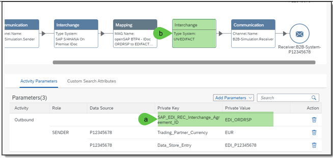

7.	This address can be taken from the custom post-processing integration flow. Therefore, open in another web browser tab the integration flow: “Pnnnnnnnn . Post-Processing . OrderResponse - Outbound. UN-EDIFACT” and 
    1.	Do a double click on the adapter line “ProcessDirect” so that you can see the details of the “ProcessDirect”.
    2.	Take in tab “Connection” the address: /TP_Pnnnnnnnn/tpm/post-processing/orderResponse-outbound/un-edifact and copy into a notepad (Please consider Pnnnnnnn should be your user id)

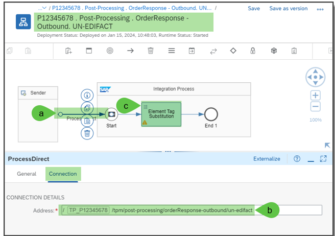

9.	Open the windows browser tab  in where you see the TPA “Procure to Pay - P12345678” including the already selected receiver interchange activity. If the TPA is in edit mode, you should:
    1.	Select the check box of “Customized Post-Processing” and enter the copied address /TP_nnnnnnnn/tpm/post-processing/orderResponse-outbound/un-edifact into the field of “Process Direct Address”.
    2.	For inserting the UNA segment into the receiver interchange payload, select the check box “Use Custom Separators” and select following values:
        1.	Segment Terminator: Apostrophe (‘)
        2.	Composite Terminator: Colon (:)
        3.	Data Element Separator Plus (+)
        4.	Escape Character: Question Mark (?)
    3.	Click on “Save” button.

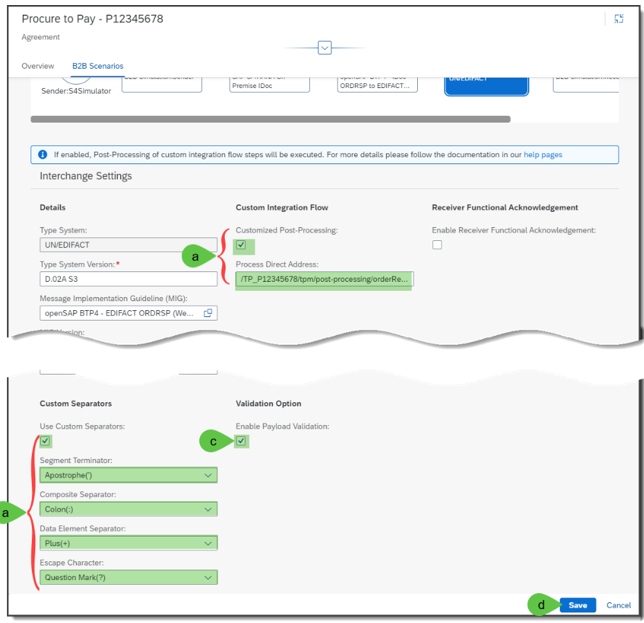

10.	Once you finished and saved the configuration click on “Update” button so that these changes will be written into the Partner Directory.

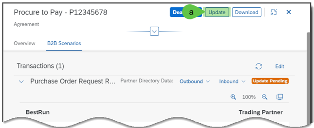

12.	Once the updated business transaction is updated successfully, 
    1.	You can now send the IDOC ORDRSP.ORDERS05 (Purchase Order Response) message via your API testing tool.
    2.	After a short while you’ll find the response with the added UNA segment
    3.	With an added value in the data element “0032 – Communications agreement ID” in the UNB segment
    4.	With an ordinal number per line item in the data element 1082 (Line item identifier)
    5.	With a resorted line items according to the values of data element (3446 - Party tax identifier) in segment group SG32 -> TAX
    6.	And with the summary of all amounts from the PRI segments of the line items in the segment MOA with the qualifier 128.

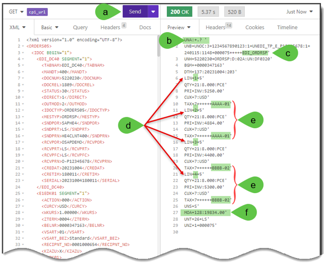

[Continue with Exercise 2D](Exercise/Ex1/EXERCISE%201D%3A%20CUSTOM%20RECEIVER%20COMMUNICATION%20CHANNEL/README.md)
