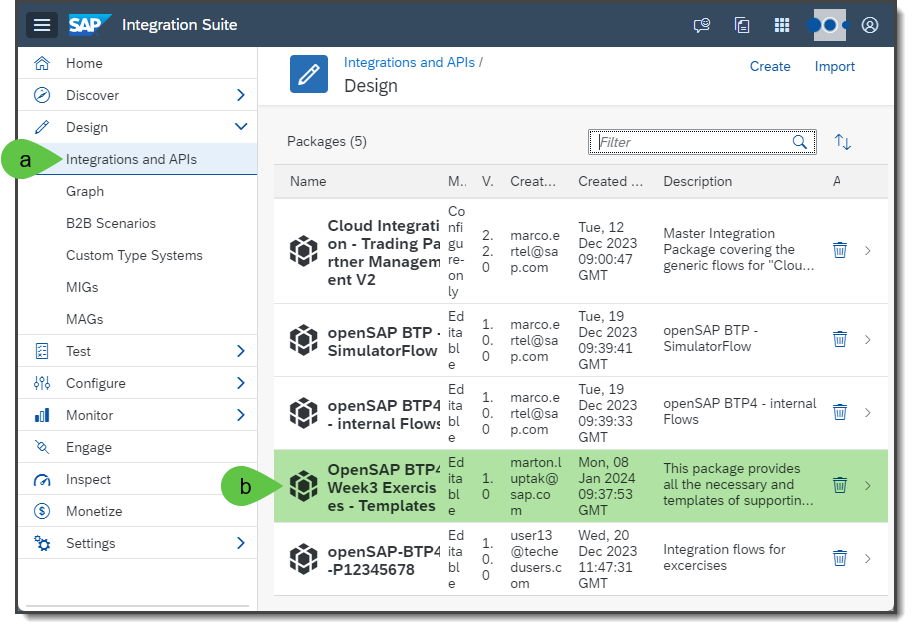
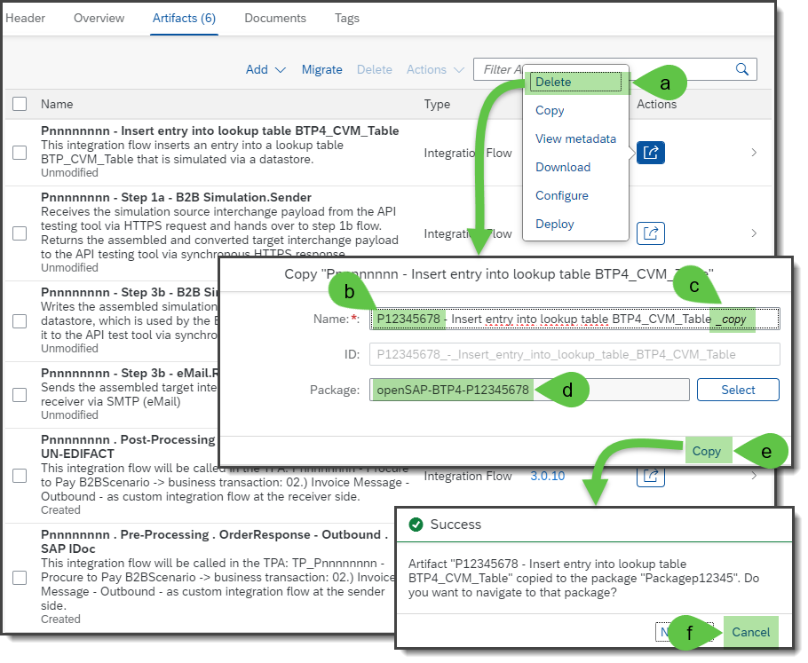
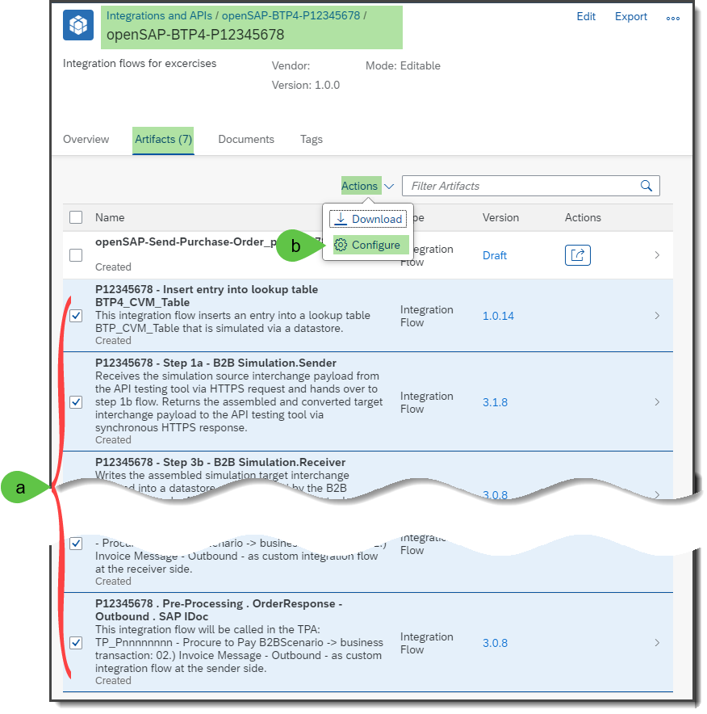
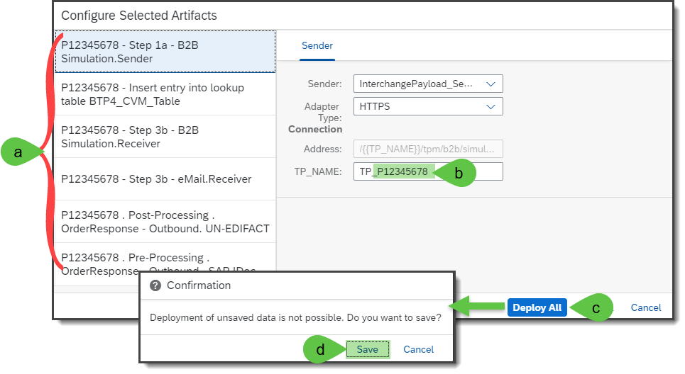

PREPARATION: COPY AND DEPLOY INTEGRATION FLOWS
For the following 5 exercises, it is necessary to copy several integrations flows to your own integration package and finally these copied integration flows should also be configured and deployed.

