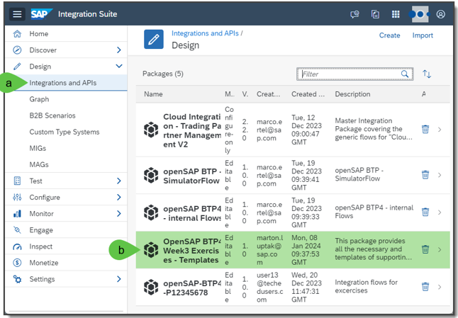
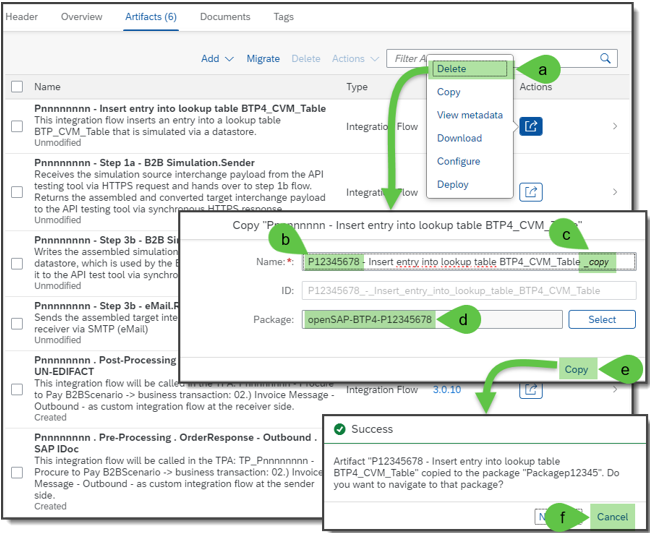
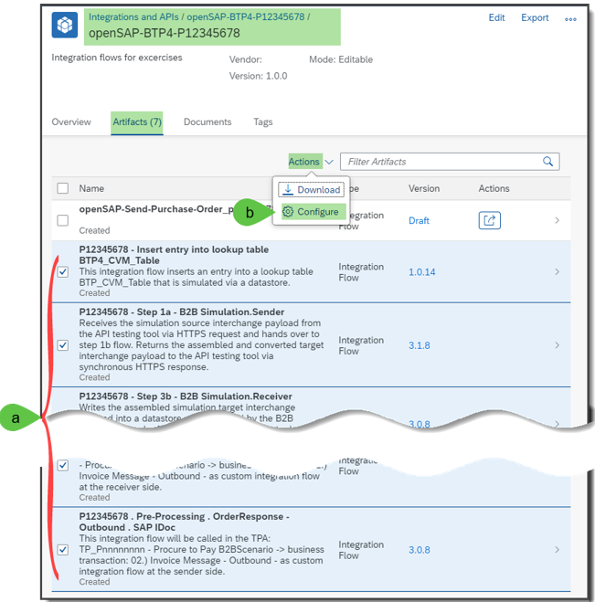
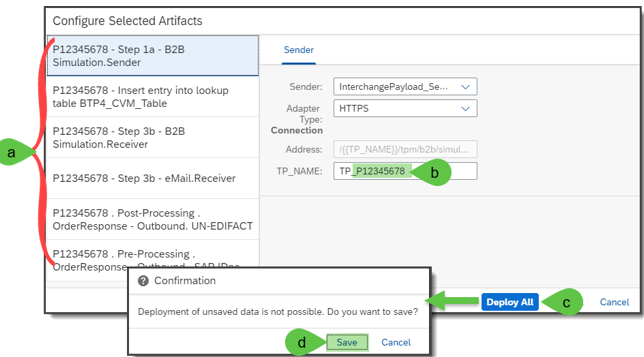

**Preparation: Copy and deploy Integration Flows**

For the following 5 exercises, it is necessary to copy several integrations flows to your own integration package and finally these copied integration flows should also be configured and deployed.

**Keep in your mind to change the IDs (e.g P123456 will be then User13 – 13 is your id). Or in other words replace “P” with “User” and the “123456” or “nnnnnn” with your id “13”.**

**Explanation:**

1. Go into your Integration Suite tenant which you used for the [exercise 1](https://github.com/SAP-samples/integration-suite-b2b-exercises-basic/tree/main/exercises/Ex01)
   1. Choose Design -> Integration and APIs
    2.Open the integration package: **OpenSAP BTP4 Week3 Exercises - Templates**

2. Copy all the 6 integration flows of this integration package into your already created integration package **openSAP-BTP4-P12345678** by the following steps:
    1.	Click per integration flow at Action button -> Copy.
    2.	In the window “Copy …” change the prefix “Pnnnnnnnn” with your user id such as “User13” 
    3.	Delete the suffix “_copy.”
    4.	Select your integration package such as **openSAP-BTP4-UserXX** (with XX replaced by your number)
    5.	Click on button “Copy.” 
    6.	In the message window click on button “Cancel” and do the same with the next integration flow

Remark: You may have mistakenly copied the integration flow to the same template integration package. Delete this integration flow from this package, please.

3. Go into your package openSAP-BTP4-UserXX -> Artifacts (with XX replaced by your number), and
    1.	Select all 6 copied integration flows which start with your user id.
    2.	Click on Actions -> Configure

4. In the window “Configure Selected Artifacts”
    1.	Change in the configuration menus of all selected integration flows. 
    2.	The placeholder “Pnnnnnn” into user id such as UserXX (e.g. TP_User13)
    3.	Once you changed user id in all configuration menus, click on button “Deploy all”.
    4.	Click on “Save” button in the message window “Confirmation”

[Start with Exercise 2](../Exercise%202/README.md)

